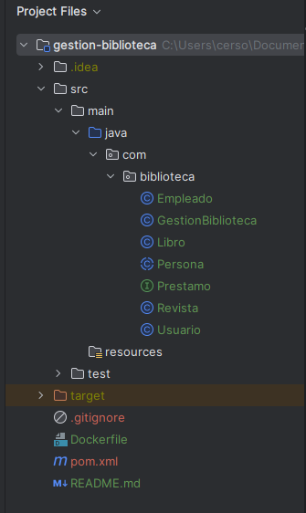
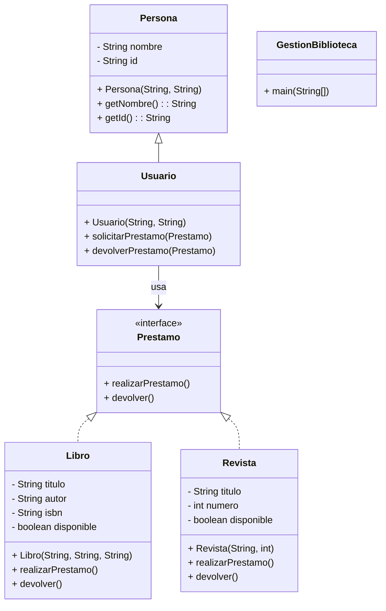

# Proyecto: Gestión de Biblioteca
## Descripción
El objetivo del proyecto es desarrollar una aplicación en Java que simule el sistema
de préstamos de una biblioteca, aplicando los principios de la Programación Orientada a Objetos (POO) como **abstracción**, **encapsulamiento**, **herencia** y **polimorfismo**.

## Requerimientos tecnicos
- Java 8 o superior
- IDE recomendado: IntelliJ IDEA, Eclipse o VS Code con extensión de Java
- Git para control de versiones
- Docker Desktop
## Requisitos
*   **Clases e Interfaces**

    *   `Persona` (abstracta): Representa a una persona en la biblioteca.

    *   `Usuario`: Hereda de `Persona` y representa a un usuario de la biblioteca.

    *   `Prestamo` (interfaz): Define métodos para realizar y devolver préstamos.

    *   `Libro` y `Revista`: Implementan `Prestamo` y representan elementos prestables.

    *   `GestionBiblioteca`: Clase principal con menú interactivo para probar la funcionalidad.

*   **Funcionalidades**

    *   Un usuario puede **prestar y devolver libros o revistas**.

    *   Se debe verificar la **disponibilidad** antes de realizar un préstamo.

    *   Aplicación de **polimorfismo** al tratar `Libro` y `Revista` como objetos de `Prestamo`.

*   **Entrega**

    *   Subir el código a **GitHub Classroom**.

    *   Documentar el código con **comentarios**.

    *   Agregar un **README.md** explicando la ejecución del proyecto.
    

* **Estructura de proyecto:**

* **Diagrama de clases**

## Criterios de Evaluación

✅ Aplicación de POO: uso de Abstracción, herencia, encapsulamiento y polimorfismo.

✅ Correcto funcionamiento de la aplicación

✅ Estructura y claridad del código

✅ Manejo de excepciones y validaciones

✅Documentación: archivo ***README.md** con instrucciones de uso.

# Importante ❗
## Para una mejor comprensión del proyectos - Resolver Cuestionario  - Gestión de Biblioteca 

### 1. ¿Cuál es la finalidad del proyecto?
### 2. ¿Cómo se aplica la abstracción en el proyecto?
### 3. ¿Qué rol cumple la interfaz Prestamo?
### 4. ¿Cómo se implementa la herencia en el proyecto?
### 5. ¿Dónde se usa el polimorfismo en el proyecto?
### 6. ¿Por qué se utilizó una interfaz en lugar de una clase abstracta para `Prestamo`?
### 7. ¿Cómo se garantiza el encapsulamiento en el proyecto?
### 8. ¿Cómo se gestiona la disponibilidad de los libros y revistas?
### 9. ¿Cómo se interactúa con el sistema?
### 10. ¿Por qué la POO es una mejor alternativa para desarrollar este tipo de sistemas?
